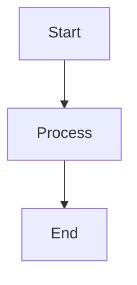
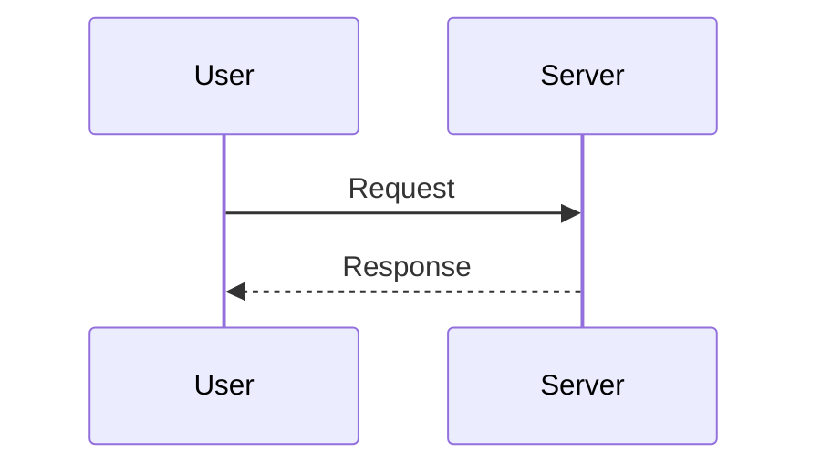
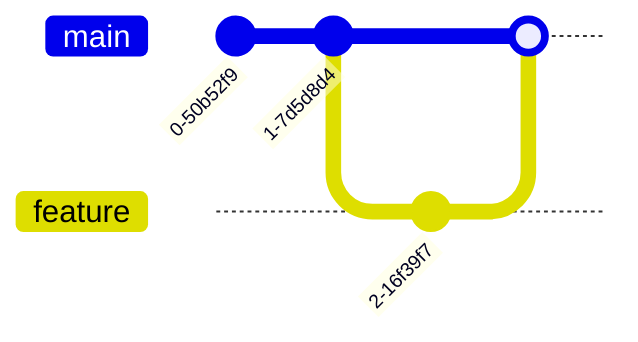

# Markdown Cheatsheet

A quick reference for writing Markdown, with GitHub-flavored Markdown (GFM) examples.

---

## 1. Headings

```markdown
# Heading 1
## Heading 2
### Heading 3
#### Heading 4
##### Heading 5
###### Heading 6
```

# Heading 1

## Heading 2

### Heading 3

---

## 2. Text Formatting

### Bold

```markdown
**Bold text**
__Bold text__
```

**Bold text**

### Italic

```markdown
*Italic text*
_Italic text_
```

*Italic text*

### Bold + Italic

```markdown
***Bold and italic***
___Bold and italic___
```

***Bold and italic***

### Strikethrough

```markdown
~~Strikethrough text~~
```

~~Strikethrough text~~

### Inline Code

```markdown
Use `npm install` to install dependencies.
```

Use `npm install` to install dependencies.

---

## 3. Paragraphs

Separate paragraphs with an empty line.

```markdown
This is the first paragraph.

This is the second paragraph.
```

---

## 4. Line Breaks

### Two Spaces

```markdown
First line.  
Second line.
```

### HTML `<br>`

```markdown
First line.<br>
Second line.
```

---

## 5. Horizontal Rule

```markdown
---
```

or:

```markdown
***
```

---

## 6. Links

### Basic Link

```markdown
[OpenAI](https://openai.com)
```

### Link with Title

```markdown
[OpenAI](https://openai.com "OpenAI Website")
```

### Automatic URL

```markdown
<https://openai.com>
```

### Email

```markdown
<hello@example.com>
```

---

## 7. Images

```markdown

```

### Image with Title

```markdown

```

---

## 8. Unordered Lists

```markdown
- Item 1
- Item 2
- Item 3
```

Result:

* Item 1
* Item 2
* Item 3

### Nested List

```markdown
- Frontend
  - HTML
  - CSS
  - JavaScript
- Backend
  - PHP
  - Laravel
```

---

## 9. Ordered Lists

```markdown
1. First
2. Second
3. Third
```

### Nested Ordered List

```markdown
1. Frontend
   1. HTML
   2. CSS
   3. JavaScript
2. Backend
   1. PHP
   2. Laravel
```

---

## 10. Task Lists

GitHub supports task lists:

```markdown
- [x] Completed task
- [ ] Pending task
- [ ] Another task
```

Result:

* [x] Completed task
* [ ] Pending task
* [ ] Another task

---

## 11. Blockquotes

```markdown
> This is a blockquote.
```

Result:

> This is a blockquote.

### Nested Blockquote

```markdown
> First level
>> Second level
>>> Third level
```

---

## 12. Code Blocks

### Inline Code

```markdown
`console.log("Hello World");`
```

### Fenced Code

Use three backticks:

````markdown
```javascript
console.log("Hello World");
```
````

### JavaScript

```javascript
const name = "Ashraful";

console.log(`Hello ${name}`);
```

### PHP

```php
<?php

echo "Hello World";
```

### HTML

```html
<div class="container">
    <h1>Hello World</h1>
</div>
```

### CSS

```css
.container {
    max-width: 1200px;
    margin: 0 auto;
}
```

### Bash

```bash
npm install
npm run dev
```

---

## 13. Tables

Basic table:

```markdown
| Name | Age | Role |
|------|-----|------|
| John | 25  | Developer |
| Jane | 28  | Designer |
```

Result:

| Name | Age | Role      |
| ---- | --- | --------- |
| John | 25  | Developer |
| Jane | 28  | Designer  |

### Table Alignment

```markdown
| Left | Center | Right |
|:-----|:------:|------:|
| A | B | C |
| D | E | F |
```

Result:

| Left | Center | Right |
| :--- | :----: | ----: |
| A    |    B   |     C |
| D    |    E   |     F |

---

## 14. Escaping Markdown Characters

Use `\` before special characters.

```markdown
\*Not italic\*
\# Not a heading
\[Not a link\]
```

Common characters:

```text
\*
\_
\#
\+
\-
\.
\!
\[
\]
\(
\)
\`
```

---

## 15. Special Characters

HTML entities can be used:

```markdown
&amp;
&lt;
&gt;
&nbsp;
&copy;
```

Result:

* `&` → `&amp;`
* `<` → `&lt;`
* `>` → `&gt;`
* `©` → `&copy;`

---

## 16. HTML in Markdown

Most Markdown processors support inline HTML.

```html
<div align="center">

# My Project

A simple project description.

</div>
```

### HTML Button

```html
<a href="https://example.com">
    <button>Visit Website</button>
</a>
```

### HTML Details

```html
<details>
<summary>Click to expand</summary>

Hidden content goes here.

</details>
```

---

## 17. Comments

Markdown comments can be hidden using HTML comments:

```markdown
<!-- This comment will not be visible in rendered Markdown. -->
```

---

## 18. Keyboard Keys

GitHub Markdown supports HTML `<kbd>`:

```markdown
<kbd>Ctrl</kbd> + <kbd>C</kbd>
```

Result:

<kbd>Ctrl</kbd> + <kbd>C</kbd>

Common examples:

```markdown
<kbd>Ctrl</kbd> + <kbd>V</kbd>
<kbd>Ctrl</kbd> + <kbd>S</kbd>
<kbd>Cmd</kbd> + <kbd>K</kbd>
```

---

## 19. Highlighted Text

Standard Markdown does not officially support highlighting.

Some Markdown processors support:

```markdown
==Highlighted text==
```

GitHub Markdown does not generally render this as highlighted text.

For HTML:

```html
<mark>Highlighted text</mark>
```

---

## 20. Superscript and Subscript

HTML can be used:

```html
H<sub>2</sub>O

X<sup>2</sup>
```

Result:

H<sub>2</sub>O

X<sup>2</sup>

---

## 21. Emojis

GitHub supports emoji shortcodes:

```markdown
:smile:
:rocket:
:heart:
:fire:
:tada:
:warning:
:star:
```

Examples:

🚀 ❤️ 🔥 🎉 ⚠️ ⭐

---

## 22. Footnotes

GitHub-flavored Markdown supports footnotes:

```markdown
Here is a sentence with a footnote.[^1]

[^1]: This is the footnote.
```

Result:

Here is a sentence with a footnote.[^1]

[^1]: This is the footnote.

---

## 23. Automatic Links

```markdown
https://github.com
```

You can also use:

```markdown
<https://github.com>
```

---

## 24. Reference Links

Instead of putting URLs directly in your text:

```markdown
[GitHub][github-link]

[github-link]: https://github.com
```

This is useful when the same link is used multiple times.

```markdown
Visit [GitHub][github] or check the [GitHub documentation][github].

[github]: https://github.com
```

---

## 25. Images as Links

```markdown
[](https://github.com)
```

---

## 26. Alerts / Callouts

GitHub supports alert syntax:

```markdown
> [!NOTE]
> This is additional information.
```

```markdown
> [!TIP]
> This is a useful tip.
```

```markdown
> [!IMPORTANT]
> This information is important.
```

```markdown
> [!WARNING]
> Be careful with this operation.
```

```markdown
> [!CAUTION]
> This action may have unexpected consequences.
```

---

## 27. Collapsible Content

GitHub supports `<details>`:

````html
<details>
<summary>View Code</summary>

```javascript
console.log("Hello World");
````

</details>
```

---

## 28. Mermaid Diagrams

GitHub supports Mermaid diagrams in Markdown code blocks.

### Flowchart

````markdown

````

### Sequence Diagram

````markdown

````

---

## 29. Mermaid Git Graph

````markdown

````

---

## 30. Mathematical Expressions

Some Markdown processors support LaTeX math.

### Inline Math

```markdown
$E = mc^2$
```

### Block Math

```markdown
$$
E = mc^2
$$
```

Example:

$$
E = mc^2
$$

---

## 31. Escaped Backticks

To display backticks inside inline code:

```markdown
``Use `code` inside this text.``
```

---

## 32. File and Folder Structure

Code blocks are useful for project structures:

```text
project/
├── app/
│   ├── models/
│   ├── controllers/
│   └── services/
├── resources/
│   ├── views/
│   └── css/
├── routes/
│   └── web.php
└── composer.json
```

---

## 33. GitHub README Example

A typical README can look like:

````markdown
# Project Name

Short description of the project.

## Features

- Feature one
- Feature two
- Feature three

## Installation

```bash
git clone https://github.com/user/project.git
cd project
npm install
````

## Usage

```bash
npm run dev
```

## Technologies

* HTML
* CSS
* JavaScript
* Laravel

## License

MIT

````

---

## 34. Badges

Badges are commonly used in GitHub README files.

```markdown

````

Example with a link:

```markdown
[](https://github.com/user/repository)
```

---

## 35. GitHub Repository Badges

Common badge types:

```markdown


```

---

## 36. Definition Lists

Not supported consistently across Markdown processors, but some support:

```markdown
Term
: Definition of the term
```

---

## 37. Checklist Example

```markdown
## Project Checklist

- [x] Setup project
- [x] Configure Git
- [x] Create database
- [ ] Build authentication
- [ ] Build dashboard
- [ ] Add tests
- [ ] Deploy
```

---

## 38. Common Markdown Symbols

| Syntax        | Purpose          |
| ------------- | ---------------- |
| `#`           | Heading          |
| `**text**`    | Bold             |
| `*text*`      | Italic           |
| `~~text~~`    | Strikethrough    |
| `` `code` ``  | Inline code      |
| `>`           | Blockquote       |
| `-`           | Unordered list   |
| `1.`          | Ordered list     |
| `---`         | Horizontal rule  |
| `[text](url)` | Link             |
| `` | Image            |
| `\`           | Escape character |
| `[^1]`        | Footnote         |
| `- [ ]`       | Task list        |

---

## 39. Quick Reference

### Headings

```markdown
# H1
## H2
### H3
#### H4
##### H5
###### H6
```

### Formatting

```markdown
**bold**
*italic*
***bold italic***
~~strikethrough~~
`inline code`
```

### Links

```markdown
[Link text](https://example.com)
```

### Image

```markdown

```

### Lists

```markdown
- Item
- Item
  - Nested item

1. Item
2. Item
3. Item
```

### Quote

```markdown
> Quote
```

### Code

````markdown
```javascript
console.log("Hello");
```
````

### Table

```markdown
| Name | Role |
|------|------|
| John | Developer |
| Jane | Designer |
```

### Checklist

```markdown
- [x] Done
- [ ] Todo
```

### Horizontal Line

```markdown
---
```

---

## 40. Markdown Best Practices

1. Use headings in a logical hierarchy.
2. Keep one blank line between major Markdown elements.
3. Use descriptive link text.
4. Always provide useful `alt` text for images.
5. Use fenced code blocks with language identifiers.
6. Keep tables simple and readable.
7. Use relative links for files inside the same repository when appropriate.
8. Keep README files focused and easy to scan.
9. Use task lists for project progress.
10. Prefer standard Markdown when portability matters.

---

## 41. Recommended README Structure

````markdown
# Project Name

Short project description.

## Features

- Feature 1
- Feature 2
- Feature 3

## Demo

[Live Demo](https://example.com)

## Screenshots


## Installation

```bash
git clone https://github.com/user/project.git
cd project
npm install
````

## Configuration

Create a `.env` file:

```env
APP_URL=http://localhost:3000
API_KEY=your_api_key
```

## Usage

```bash
npm run dev
```

## Tech Stack

* HTML
* CSS
* JavaScript
* React
* Laravel

## Project Structure

```text
project/
├── src/
├── public/
├── package.json
└── README.md
```

## Contributing

1. Fork the repository.
2. Create a branch.
3. Make your changes.
4. Commit your changes.
5. Open a pull request.

## License

MIT

````

---

## 42. Useful GitHub Markdown Features

GitHub-flavored Markdown adds several useful features beyond basic Markdown:

- Task lists
- Tables
- Footnotes
- Alerts
- Strikethrough
- Autolinks
- Mermaid diagrams
- Syntax-highlighted code blocks
- `<details>` / collapsible sections
- HTML elements
- Emoji shortcodes

---

## 43. Cheat Sheet

```text
# Heading
## Subheading

**Bold**
*Italic*
***Bold Italic***
~~Strike~~
`Code`

[Link](https://example.com)


- List
- List
  - Nested

1. Ordered
2. List

> Quote

---

```language
code
````

| Column | Column |
| ------ | ------ |
| Data   | Data   |

* [x] Complete
* [ ] Todo

[^1]

> [!NOTE]
> Note

<details>
<summary>Details</summary>
Hidden content.
</details>
```

---

## License

This cheatsheet is provided for personal learning and reference.
